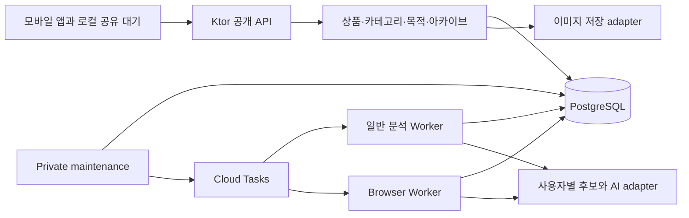

# 와이어프레임을 지원하는 MVP 제품 API 설계

> 상태: 설계 제안 · 2026-10-04 · 아직 구현·승인된 API 계약이 아님

## 목표와 기준

디자인을 진행하는 동안 서버의 조회·사용자 변경·목적별 비교·아카이브를 구현할 수 있도록 화면과 데이터의 경계를 정한다. 사용자는 상품 URL을 먼저 보관하고, 자동 결과를 검토·보완하며 목적별로 비교한 뒤 구매 결정을 기록한다.

기준은 `design/handoff@c59741d`의 제품 규칙·디자인 결정과 `server/initial-setup@9eacba5`의 코드다. 서버 워크스페이스의 product 문서는 아직 디자인 브랜치 변경을 포함하지 않으므로 구현에 앞서 관련 문서 변경을 통합해야 한다. 전체 API 목록은 이후 `design/handoff@51c67e0`까지 다시 대조했다. 이번 설계는 기존 [상품 상태·API 계약](../wishlist-item-state-api.md)을 보완하는 제안이며 기존 확정 문서를 자동으로 대체하지 않는다.

## 구조 선택

| 방법 | 이 프로젝트에서의 비용·이점 |
| --- | --- |
| **Ktor modular monolith 확장 — 권장** | 기존 JDBC·Flyway·Worker 활용. 사용자 변경과 아카이브를 같은 DB transaction으로 처리 가능 |
| 기능별 독립 서비스 | 서비스 간 transaction·운영·배포 경계가 늘어 MVP의 목적·상품 동시 변경이 복잡해짐 |
| BaaS 직접 접근으로 전환 | 인증·DB 접근 흐름과 기존 서버 권한·outbox·분석 경계를 다시 만들어야 함 |

Ktor API와 분석 Worker는 같은 코드베이스·DB를 사용하되 별도 Cloud Run 서비스로 배포한다. 역할별 의존성을 조립하고 private worker·maintenance endpoint를 공개 API 서비스에 등록하지 않는다.



목록 시트·스와이프·색 테마·쿠키·웹뷰 탐색·사진 선택·로컬 대기는 클라이언트 책임이다. 서버는 인증된 데이터, 허용되는 변경, 변경 결과와 복구 가능한 오류를 제공한다.

## 코드 경계

- `http`: request/response DTO, 인증 context, validation과 오류 mapper. SQL·상태 전이는 두지 않는다.
- `wishlist`: 조회·편집·삭제·검토·보완·재분석 use case, 허용 상태·requiredAction 계산.
- `category`: 공용 taxonomy projection, 사용자 category CRUD·개수 제한·삭제 영향.
- `purpose`: CRUD, 후보 조회·일괄 이동, 활동 시각과 membership version.
- `archive`: 목적 종료 snapshot·제목 수정·전체 복원·전체 삭제.
- `media`: 업로드 의도·확인·소유자 검사·참조와 미사용 객체 정리.
- `persistence`: transaction runner, SQL repository, DTO와 독립된 row mapping. 기존 JDBC를 유지하고 필요한 SQL부터 이동한다.
- 기존 `analysis/extraction/browser/ai/tasks/budget`: 작업 실행·외부 호출. 최종 item 반영은 공통 상태 전이·transaction 경계를 사용한다.

초기에는 Gradle module을 추가하지 않고 package·interface 경계를 둔다. SQL을 화면별 controller마다 복사하거나 모든 작업을 하나의 거대한 service에 넣지 않는다. 각 단계는 use case와 실제 DB 제약을 함께 검증한다.

## 데이터 모델

기존 V1~V7을 수정하지 않고 새 Flyway migration으로 확장한다.

| 자원 | 필드와 역할 |
| --- | --- |
| `app_users` | 현재 방식으로 계산한 owner UUID, Firebase project/UID, 생성 시각. 기존 item owner를 그대로 사용하며 lazy upsert. 사용자 구조 변경 transaction의 잠금 기준. 기존 UUID에서 UID를 역산할 수 없으므로 backfill 계정의 Firebase 정보는 nullable로 두고 인증 시 채움 |
| 공용 taxonomy | 기존 `C001` 등 안정된 ID·그룹·표시 순서를 유지. 공개 조회의 category metadata. 이름을 ID로 사용하지 않음 |
| `custom_categories` | UUID, owner, public parent group의 안정된 key, 입력 원문·중복 비교용 normalized name, 설명·예시, AI 후보 허용 상태, version·deletedAt |
| `purposes` | UUID, owner, 이름·설명, colorKey·iconKey, lifecycle, version·membershipVersion·activityAt |
| `wishlist_items` 확장 | 현재 public/custom category 참조, 목적 참조, 각 값의 출처, predicted 값, reviewStatus·manualCompletionAt·categoryMissingReason, currentAnalysisGeneration, 사진 자원 참조·metadata 확인 시각 |
| 상품 metadata | 이름·설명·브랜드·판매처·이미지, decimal 가격·ISO 통화, metadataCheckedAt. 가격은 문자열이나 부동소수점으로 보관하지 않음 |
| `analysis_jobs` 확장 | execution claim token·lease, metadata fingerprint·prompt/taxonomy version, staged metadata·선택 후보의 version snapshot |
| `archive_records` | owner, originalPurposeId, 편집 가능한 제목, 종료 시각, 구매 item ID, 목적 snapshot, record version·lifecycle |
| `archive_items` | archive ID·original item ID, 당시 item metadata·category label·review 등 복원에 필요한 snapshot. 표시가 현재 목적·category join에 의존하지 않음 |
| `media_assets` | owner, object key, MIME·크기·이미지 치수, PENDING/READY 상태, 활성·archive 참조. 만료 signed URL을 영속 식별자로 사용하지 않음 |
| `mutation_receipts` | owner + operation + Idempotency-Key, request fingerprint와 결과 ID. 재전송 시 생성·일괄 변경 결과 중복을 방지 |
| 후속 `products` cache·중복 판단 | canonical metadata 재사용과 owner별 중복 해소 기록. 사용자 item을 캐시와 계속 동기화하지 않음 |

public category ID와 custom category ID는 내부 컬럼을 분리해 둘 중 최대 하나만 값이 있도록 CHECK한다. custom category·purpose 참조는 owner와 ID의 복합 FK로 사용자 간 연결을 막는다. 공개 DTO는 두 종류를 공통 category 표현으로 합친다. nullable category는 정보 보완 상태에서 허용한다.

custom category 삭제는 먼저 참조를 해제하고 누락 사유를 기록한다. 이름 변경·삭제가 archive snapshot을 변경하지 않는다. 같은 상위 안의 normalized name은 삭제되지 않은 category에 대해 unique로 제한한다. 20개 제한은 사용자 transaction 잠금 아래 검사해 동시 생성도 한도를 넘지 않게 한다.

purpose 색·아이콘은 서버가 허용 key를 검증하고 앱이 테마별 색상·SVG에 매핑한다. wireframe 회색·배열 index를 저장하지 않는다. 팔레트 6색과 필수 아이콘 규칙은 확정된 제품 입력이며 key 목록·기본 key는 클라이언트와 맞춘 뒤 migration/API에 고정한다.

사용자 수정은 item snapshot만 바꾼다. 외부 추출 이미지 URL은 기존 값을 보관할 수 있으나 장기 아카이브 표시의 영속성은 별도 저장 정책이 필요하다. 사용자 업로드는 안정된 object 참조를 보존하고 archive 참조가 남은 이미지를 정리하지 않는다.

## 상품 상태와 홈 표현

상태 축을 하나의 enum으로 합치지 않는다. `analysisStatus`, `reviewStatus`, `lifecycleStatus`, 수동 완료, 누락 사유를 각각 보관한다. `requiredAction`과 `allowedActions`는 현재 상태에서 계산하며 사용자 입력으로 받지 않는다.

| 조건·우선순위 | 공개 requiredAction | 허용 행동 |
| --- | --- | --- |
| 로컬 전송 전 | 기기에서 ANALYSIS_PENDING | 로그인·전송 재개·로컬 삭제 |
| ACTIVE + PROCESSING | ANALYSIS_IN_PROGRESS | 원본 보기·삭제 |
| ACTIVE + 이름 또는 category 누락 | INFORMATION_COMPLETION | 상태에 맞는 편집/보완, 조건부 재분석, 삭제 |
| ACTIVE + 필수 정보 존재 + review PENDING | CLASSIFICATION_REVIEW | 확정·보류·category/purpose 수정·중복 비교 |
| ACTIVE + 위 조건 없음 | NONE | 일반 조회·편집·삭제 |
| ARCHIVED/DELETED | 홈 대상 제외 | archive 작업 또는 삭제 tombstone 처리 |

AI_ABSTAINED·AI_RESPONSE_UNUSABLE·CUSTOM_CATEGORY_DELETED는 INFORMATION_COMPLETION의 이유로 반환하며 별도 홈 영역을 만들지 않는다. 일반 목록은 ACTIVE + 이름/category 존재로 판단하고 미확정 review도 포함한다.

직접 보완은 PARTIAL/실패에 대해 이름+category를 요구하고 manualCompletionAt·CONFIRMED를 기록한다. READY에서 category 삭제 후 재지정은 일반 PATCH로 처리하며 manualCompletionAt을 새로 만들지 않는다. 같은 보완 UI가 상태별 명령을 선택하도록 allowedActions를 반환한다. 실패 때에도 이름/category가 이미 있다면 재분석 가능 여부를 상세 DTO에 따로 제공해 홈 밖에서 복구할 수 있게 한다.

review DEFER는 자동으로 검토 영역에 재노출하지 않는다. category와 purpose의 사용자 확정 출처를 구분하고 목적의 명시적 연결 해제도 사용자 결정으로 기록한다. 이후 AI가 사용자의 목적 해제를 덮어쓰지 않는다. 이번 제안은 완료 검토를 다시 여는 API를 추가하지 않는다.

## API 목록과 응답 원칙

모든 `/v1` 요청은 Firebase token의 owner 범위에서 처리한다. 다른 사용자의 ID는 404, 상태·version 충돌은 409, 형식·필드 validation은 기존 오류 계약에 맞춰 400/422로 구분한다. 오류에는 code·requestId·필드별 안전한 details를 포함하고 서버 예외는 노출하지 않는다.

전체 목록의 기준은 [MVP 화면·기능별 API 목록](mvp-api-inventory.md)이다. `design/handoff@51c67e0`의 제품·디자인 문서와 43개 보드를 대조해 **제품 API 37개**를 method+path 단위로 나열했으며, 화면별 행동·최소 입출력·현재 구현 여부·미결정 사항을 함께 기록했다.

| 영역 | API 수 | 범위 |
| --- | ---: | --- |
| 상품 | 8 | 생성·목록·상세·편집·삭제·재분석·보완·검토 |
| 홈 | 2 | 요약·연속 처리 목록 |
| 중복 | 2 | 후보 비교·판단과 선택 삭제 |
| 카테고리 | 6 | 탐색·사용자 category 상세/생성/수정·삭제 영향/삭제 |
| 목적 | 8 | 목록·생성·상세·수정·삭제 영향/삭제·추가 후보/일괄 이동 |
| 아카이브 | 9 | 종료 미리보기/생성·목록·상세·후보 페이지·제목·복원 미리보기/복원·삭제 |
| 이미지 | 2 | 업로드 의도·완료 확인 |

최초 구조 제안의 요약에서 빠졌던 custom category 상세, archive 종료/복원 미리보기와 snapshot 후보 페이지를 포함했다. 기존 endpoint의 역할을 재사용하는 item 삭제 영향·후보 category facets는 별도 API로 중복 집계하지 않았다. 내부 Worker/maintenance 3개와 health 1개는 제품 수에 포함하지 않는다.

이 수는 권장 HTTP 구성안이다. URI를 코드에 추가하기 전에 request/response와 오류 code를 계약 문서로 고정한다. 아래 내용은 구조·응답·동시성의 설계 원칙이며 세부 목록은 연결된 문서에서 관리한다.

상품 응답은 현재 product snapshot과 브랜드·판매처·확인 시각, category/purpose의 ID·표시명·출처·목적 colorKey/iconKey, 세 상태 축·누락 사유·version을 포함한다. 클라이언트가 항목마다 목적·카테고리를 따로 조회하지 않게 요약을 함께 반환한다.

첫 구현의 정상 응답 예시는 다음과 같다. 생성 직후에는 아직 얻지 못한 metadata·category·purpose를 null로 표현하고, 분석 후에는 같은 mapper가 실제 값을 읽는다. 아래 ID와 값은 예시다.

```json
{
  "id": "item-uuid",
  "clientSubmissionId": "submission-uuid",
  "version": 2,
  "sourceUrl": "https://shop.example/item",
  "product": {
    "name": "노이즈 캔슬링 헤드폰",
    "brand": null,
    "imageUrl": null,
    "price": null,
    "currency": null,
    "merchant": null,
    "metadataCheckedAt": "2026-10-04T02:00:00Z"
  },
  "category": { "id": "C026", "name": "헤드폰", "source": "AI", "missingReason": null },
  "purpose": { "id": null, "source": "UNASSIGNED" },
  "analysis": { "status": "READY", "failureCode": null },
  "reviewStatus": "PENDING",
  "lifecycleStatus": "ACTIVE",
  "requiredAction": "CLASSIFICATION_REVIEW",
  "allowedActions": ["EDIT", "DELETE", "REVIEW"],
  "manualCompletionAt": null,
  "createdAt": "2026-10-04T01:59:00Z",
  "updatedAt": "2026-10-04T02:00:00Z"
}
```

allowedActions의 제안 key는 EDIT·DELETE·REVIEW·MANUAL_COMPLETE·REANALYZE다. 원본 URL 열기는 분석 상태와 관계없이 가능한 클라이언트 행동이다. 이미 DELETED인 item의 일반 GET은 404로 처리하고 생성 key 재전송은 기존 ID와 DELETED 표현을 반환해 새 item을 만들거나 로컬 대기에 되돌리지 않는다. 이 특수 응답의 allowedActions는 비어 있다.

PATCH의 필드 누락은 변경 없음, 명시적 null은 optional 값 해제다. category null은 일반 편집에서 허용하지 않고 category 삭제 use case에서만 발생시킨다. price·currency·sourceUrl은 사용자 편집 대상으로 받지 않는다. 이미지 업로드 후 mediaId를 연결하며, 서버가 해당 owner의 READY 자원인지 확인한다.

상품 목록은 기존 최근 저장순 `(created_at,id)`을 유지한다. 생성 응답은 commit된 최신 item을 읽는다. clientCreatedAt은 별도 sharedAt으로 검증·보관할 수 있지만 서버 정렬 기준을 조용히 바꾸지 않는다. cursor는 owner·필터·정렬 key를 묶어 검증하고 limit과 before/after에 상한을 둔다.

홈 미리보기·연속 처리·일반 목록은 같은 requiredAction predicate와 visibility predicate를 사용한다. 홈의 요약/미리보기는 단일 SQL 또는 짧은 동일 snapshot 읽기로 집계해 내부 불일치를 줄인다. 갱신 중 항목이 사라지면 다음 최신 window로 이어가며 목록 전체를 내려주지 않는다.

기존 MVP의 갱신 정책을 유지한다. 앱 진입·foreground 복귀·사용자 새로고침에 필요한 범위만 조회하고 주기 polling·push/realtime·전역 증분 sync는 이 설계에서 추가하지 않는다.

## 변경과 동시성

MVP에서는 owner별 구조 변경을 짧은 DB transaction으로 직렬화하는 것을 권장한다. `app_users` 행을 먼저 잠근 뒤 관련 purpose/category, item ID 순서, job 순서로 잠근다. 모든 사용자 변경과 Worker 최종 반영이 같은 순서를 지킨다. 외부 HTTP·AI·이미지 업로드 동안 DB 잠금을 유지하지 않는다. 조회는 잠금 없이 수행한다. 사용자 단위 쓰기 병목이 관측될 때 resource별 잠금으로 세분화한다.

이 선택은 현재 개인 위시리스트의 쓰기 빈도와 여러 자원의 원자적 변경을 고려한 제안이다. PostgreSQL row lock과 일정한 잠금 순서의 동작은 [공식 잠금 문서](https://www.postgresql.org/docs/16/explicit-locking.html)에 근거한다.

| 명령 | 같은 transaction에서 보장할 내용 |
| --- | --- |
| 일반 편집·보완·검토 | expectedVersion, ACTIVE/허용 분석 상태, 참조 owner·존재 확인, 현재 값·출처·review·version 갱신 |
| 사용자 category 삭제 | 영향 대상 재조회, category 비우기·누락 사유·item version 갱신, category 삭제 표시, archive 유지 |
| 목적 삭제 | 연결된 item의 purpose를 해제하고 그 해제 출처를 사용자로 기록. 다른 category의 미확정 review를 일괄 CONFIRMED로 바꾸지 않음 |
| 후보 일괄 이동 | 목적·item expectedVersion과 기존 소속·연결 변경 허용 상태 검증, 다른 목적에서 해제·새 목적 연결, 양쪽 membershipVersion 변경. 하나라도 불일치면 전체 거절 |
| 아카이브 생성 | ACTIVE 목적·후보 ≥1·구매 item 소속 확인, membershipVersion/후보 version 검증, snapshot 생성, 목적과 전체 item ARCHIVED, 진행 작업 취소 |
| 복원 | 유효한 archive/version, 원래 목적·전체 item ACTIVE, 구매 지정 해제, 기록 RESTORED. 편집된 archive 제목과 원래 목적 이름은 구분. 참조 category 유효성은 복원 정책에 따라 검사 |
| 삭제 | item DELETED·version 갱신, job CANCELLED. 같은 owner의 이미 삭제한 item은 204. archive 삭제는 전체 대상만 처리 |
| 재분석 | 허용 상태·수동 완료 없음 확인, current generation 증가, 이전 job 취소, PROCESSING·새 job/outbox 생성 |

아카이브 확인 UI는 서버가 준 membershipVersion과 item version을 실행 요청에 돌려보낸다. 확인 후 다른 기기가 후보를 추가·이동·편집하면 409로 다시 영향 범위를 보여준다. 모르는 새 후보를 조용히 함께 archive하지 않는다. 후보가 많으면 서버가 전체 version 목록 대신 snapshot fingerprint를 계산해 비교할 수 있으나 첫 구현 계약에서는 하나의 방식을 고정한다.

category·purpose 삭제 영향 확인에도 대상 version과 영향 item의 fingerprint를 반환해 최종 삭제 요청에서 재검증한다. 보지 못한 새 연결을 포함해 삭제하지 않는다. archived item의 일반 편집·삭제·Worker 반영은 거부하며, 복원 시 취소된 이전 job을 되살리지 않는다. 종료 시 진행 중인 작업이 있었으면 복원 뒤 허용 상태와 새 generation 생성 정책을 archive 구현 전에 정한다.

생성형 명령·bulk 이동·archive/restore는 Idempotency-Key + request fingerprint를 사용한다. mutation receipt와 결과 변경을 같은 transaction에 기록한다. key 재사용 시 같은 요청은 기존 결과 ID로 재조회, 다른 요청은 409다. 삭제는 기존 idempotent 의미를 유지한다.

## Worker 결과 반영과 운영 연결

claim에는 job ID·generation·executionToken·leaseUntil을 포함한다. 최종 성공·PARTIAL·terminal·retry·복구는 item.currentGeneration, job.executionToken, 현재 stage, ACTIVE lifecycle과 수동 변경을 검사한다. 검사 실패한 이전 실행은 사용자 값을 쓰지 않고 ACK한다.

후보 공급은 job→item→owner를 따라 공용 taxonomy·AI 허용 사용자 category·최근 활성 purpose 최대 10개를 읽는다. owner와 후보 version·metadata fingerprint·prompt/taxonomy version을 저장한다. 반영 시 category/purpose의 소유자·활성 상태·관련 version을 다시 검증한다. stale 작업은 취소하고 제품 정책상 아직 자동 판단이 필요한 경우에만 새 generation을 만든다. 사용자 확정·해제를 보존한다.

분석 deadline을 task 수준에서 계산하고 fetch·token 검사·AI 호출에 남은 시간을 전달한다. 고정 단계 timeout의 합이 Worker 예산을 넘지 않게 한다. 내부 실패 상세는 job/운영 로그에, 안정된 공개 실패 code는 item에 기록한다.

generation 전체 deadline과 retry budget을 공통으로 보관하고 일반/browser의 진단용 카운터와 구분한다. 현재 단계마다 새 30분을 시작하는 구현을 전체 30분 정책으로 정리한다. fallback 첫 실행·인프라 재실행의 횟수 계산은 기존 재시도 정책과 함께 테스트 표로 고정한다. DNS 조회 장애 같은 일시적 연결 오류와 실제 사설 주소 차단을 같은 terminal code로 처리하지 않는다.

runtime은 `api`, `general-worker`, `browser-worker`, `maintenance`를 명시적으로 조립하는 방향을 권장한다. maintenance는 outbox 발행·중단 job 복구·budget 정산/경고·미사용 media 정리를 제한된 batch로 실행한다. Scheduler의 1분 주기 호출은 private maintenance 서비스로 향한다. Worker/Scheduler 호출자의 ID token과 invoker 권한 설정은 [Cloud Run 공식 안내](https://docs.cloud.google.com/run/docs/authenticating/service-to-service)를 따른다.

JDBC 작업과 동기 외부 호출은 IO dispatcher에서 실행하고, DB pool·HTTP client·Cloud Tasks client를 역할별로 재사용해 application 종료 시 닫는다. 초기 pool 크기는 API 5·Worker 2를 측정 시작값으로 제안하며 instance 최대 수를 곱한 총 연결이 DB 허용 범위 안에 있는지 확인한다. 수치는 배포 승인값이 아니다.

### B0에서 구체화한 실행 보호

[B0 상세 구현 계획](../../superpowers/plans/2026-10-04-b0-server-foundation.md)은 `AnalysisClaim`을 processor·classifier까지 전달하고 pending metadata/assignment/failure/candidate snapshot과 예산 reserve에도 같은 DB 보호를 적용한다. claim에는 owner와 claimed item version을 포함해 같은 generation의 실행 교체·수동 변경도 구분한다. 원격 호출 동안 DB 잠금을 유지하지 않으며 item→job→예산 window 순서를 지킨다.

lease는 현재 120초 복구 기준에 맞추고, 모든 결과와 retry/fallback/recovery는 token을 회전 또는 해제한다. stale 실행은 현재 token을 취소할 수 없다. 이미 발생한 AI 비용 정산은 item 결과 쓰기와 분리한다. 일반/browser의 전체 retry 예산 재구성과 runtime 배포는 B5다.

기존 requiredAction 값은 유지하고 홈 표시용 그룹을 따로 계산한다. 사용자 category 재지정과 실패/PARTIAL 수동 완료를 같은 홈 영역에 표시해도 허용 API는 구분한다. 새 claim 없는 V7 실행은 복구로 이어받으며 production schema 전환 때는 구 Worker를 먼저 drain해야 한다.

## 이미지 저장

기존 GCP 환경을 고려해 Cloud Storage private bucket adapter를 권장한다. API는 owner·형식·크기 제한을 검증해 업로드 intent와 짧은 만료 URL을 발급하고, 앱이 업로드한 뒤 서버가 객체 존재·실제 이미지 형식·치수를 확인해 READY로 만든다. private 이미지 읽기는 서버가 owner 확인 뒤 만료 URL을 발급한다. signed URL은 보유자에게 유효기간 동안 접근 권한을 주므로 로그에 남기지 않는다. [Cloud Storage 공식 signed URL 안내](https://docs.cloud.google.com/storage/docs/access-control/signed-urls)

편집 취소 후 남은 PENDING/미참조 이미지와 archive 참조가 있는 이미지를 구분해 정리한다. 초기 형식·크기 제한, 외부 추출 이미지의 영속 복사 여부와 비용은 이미지 단계에서 결정한다. 사진 선택 자체는 이미 확정된 제품 기능이다.

## Product cache와 중복 후보

기존 정책의 공용 Product cache는 canonical metadata 재사용 용도다. 새 item에 한 번 복사하되 category/purpose는 owner별로 다시 판단하고 이전 item을 갱신하지 않는다. cache 도입은 사용자 조회·변경을 완성한 뒤 별도 단계로 진행할 수 있다.

canonical 정규화는 fragment와 승인된 tracking query를 처리하고 상품 variant 식별 query를 보존한다. `rel=canonical` 등 추출된 주소는 SSRF 규칙과 도메인/상품 식별 조건을 검사하고 그대로 신뢰하지 않는다. 현재 fetch 완료 URL만으로 다른 판매처의 동일 상품을 확인할 수 없다.

첫 중복 검출 구현은 동일 canonical의 활성 item을 정확히 찾는 범위로 제안한다. 다른 판매처의 동일 상품은 신뢰할 수 있는 GTIN·브랜드+모델 식별자 또는 별도 검증 규칙이 필요하므로 제품 검토 후 추가한다. 이 단계 구분은 전체 중복 제품 범위를 변경하는 확정 결정이 아니다. ‘둘 다 유지’ 기록은 review 확정과 별도로 보관하고 단순히 두 item을 남기는 동작으로 대체하지 않는다.

## 인덱스와 migration 순서

- item ACTIVE 목록: `(owner_id, created_at DESC, id DESC)`, public/custom category별 및 purpose별 같은 정렬 key. 실제 쿼리에 필요한 인덱스만 추가하고 `EXPLAIN`으로 확인한다.
- 홈: owner+lifecycle+analysis/review/category null 조건. 처음에는 단일 predicate로 계산하고 실제 비용이 높을 때만 projection 저장을 검토한다.
- custom category: owner+parent+normalizedName의 active unique, owner 활성 개수 조회.
- purpose: owner+lifecycle+activityAt+id. 정렬 규칙은 아래 미결정 사항을 확정한 뒤 사용한다.
- archive: owner+종료 시각+id, archive item은 archive+원본 item unique.
- job: 현재 item generation unique와 stage/lease 조회, receipt: owner+operation+key unique.

확장 migration은 nullable 필드·새 테이블 → 기존 owner/state backfill → 검증 → 필요한 NOT NULL/CHECK/FK와 인덱스 순서다. READY의 predicted category는 현재 category의 초기 AI 값으로 옮기되 review 상태는 제품 검토 규칙에 맞게 설정한다. 기존 null 정보와 실패 사유를 임의로 수동 완료 처리하지 않는다. 기존 item UUID·owner UUID·submission uniqueness는 보존한다.

## 구현 순서

실제 구현 순서의 기준은 [MVP API 구현 순서 계획](mvp-api-implementation-order.md)이다. 이전의 7단계 개요를 API 37개별 최초 배정·선행 조건·통과 기준으로 구체화했다.

최소 안전 기반 → 상품 상세/생성 → category 기본 관리 → purpose 기본 관리 → 상품 목록/홈 → 분석/복구 runtime → 이미지 → 상품 변경 → 후보 이동/영향 삭제 → 중복/cache → archive → 출시 검증 순서다.

category/purpose/media를 참조하는 상품 변경은 해당 자원이 준비된 뒤 구현한다. Worker의 current generation/execution 보호는 첫 기반에서 보완하며 browser/maintenance runtime을 사용자 재분석 전에 완성한다. 기존에 마지막으로 묶었던 runtime 연결을 앞당겨 변경 API의 선행 조건을 분명히 했다. 세부 구현 명세는 각 묶음 시작 전에 계약·파일·테스트 단위로 작성한다.

## 검증 계획

- 단위: requiredAction·allowedActions·필드 해제·review 출처·상태 전이 표.
- 실제 PostgreSQL: empty migration/기존 schema upgrade, owner FK·unique·20개 제한, CAS, bulk/아카이브 원자성, 일관된 잠금 순서, stale generation/execution token 경쟁.
- API: 동일 DTO의 생성/GET/replay, 인증·사용자 격리, cursor 범위, validation·requestId·409와 입력 복구 정보.
- 통합: fake extraction/AI/queue로 생성→READY→보완/검토→목적 이동→archive→restore.
- 운영: Docker 테스트 실행 기반 마련 후 private worker/Scheduler 실제 호출·복구·timeout·부하·secret 설정을 확인. 기존 출시 평가 정책을 생략하지 않는다.

현재 검토에서 실행한 것은 기존 소스 컴파일과 Docker 불필요 테스트 24건이다. 위 신규 기능의 테스트 완료를 의미하지 않는다. 상세 결과는 [정밀 검토 기록](../../history/architecture/server/technical-design-checkpoint-2026-10-04.md)에 있다.

## 남아 있는 제품 결정과 제안 기본값

다음은 아직 확정하지 않았다. 첫 상품 조회·표현 구현은 이 결정과 독립적으로 진행 가능하다.

| 항목 | 제안 | 확정 시 영향 |
| --- | --- | --- |
| 목적 활동순 | 후보 membership 변경 시 activityAt 갱신, 빈 목적 생성 시 createdAt 사용. 단순 조회로 순서 변경하지 않음 | 홈/목적 목록 sort·AI 최근 목적 후보 선정 |
| 후보 초기 filter | 빈 목적·혼합 category는 전체, 한 종류면 그 category | candidate-items 요청의 초기값 |
| 연속 처리 재진입 | 현재 requiredAction 대상 재조회, 완료/보류 재개 버튼 제외 | client queue와 새 API 필요 여부 |
| 목적·상품 입력 제한 | 서버/클라이언트 동일 제한을 정하고 목적 이름 중복은 ID 기반으로 허용하는 방향 | DTO validation·schema 제한 |
| archive 복원 | 목적 설명·색·아이콘도 snapshot 보존. 사라진 custom category는 빈 category+정보 보완으로 복원하는 방향 | snapshot schema·복원 상태 |
| archive 정렬 | 종료 시각 내림차순, 검색은 기존 MVP 제외 | cursor·목록 쿼리 |
| 서로 다른 판매처 중복 | 식별자 기반 지원 범위를 별도로 확정 | 추출 필드·동일성 검사·사용자 안내 |

디자인 문서의 이미 확정된 규칙과 이 제안 기본값을 구분한다. 사용자 검토 후 해당 제품 문서·상태/API 계약에 반영하고 각 구현 묶음의 구체적인 실행 계획을 작성한다.
